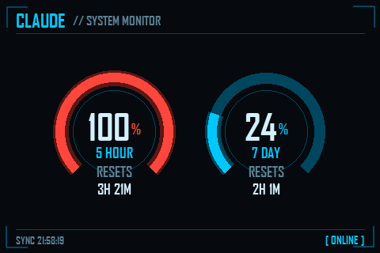
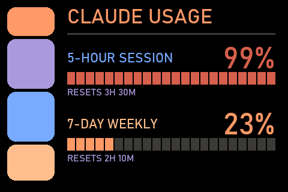

I live in Claude Code most of the day, and I kept wanting to know — at a glance,
without alt-tabbing or opening a menu — how much of my usage window I'd burned
through. There are taskbar widgets that do this, but they clutter the one strip
of screen real estate I'm most protective of. What I actually wanted was an
*ambient* readout: a little dedicated display off to the side that just shows the
numbers.

I had a [Turing 3.5" USB smart screen](https://turzx.com/) in a drawer. Perfect.

## What it shows

Claude's usage has two rolling windows: a **5-hour session** window and a
**7-day** window. The panel renders both as gauges, with a live countdown to when
each one resets:

- **5-hour** — almost always the one you bump into during a heavy session.
- **7-day** — the slower-moving budget. When its reset is more than a day out the
  panel prints the actual day ("Tue 3PM") instead of an unreadable "6d 16h."

## Where the numbers come from

Claude Code stores an OAuth token locally (in `~/.claude/.credentials.json`). The
tool reads that token and calls an endpoint the official usage UIs use:

```
GET https://api.anthropic.com/api/oauth/usage
anthropic-beta: oauth-2025-04-20
```

which returns `five_hour` and `seven_day` utilization plus reset timestamps. That
endpoint is undocumented and reverse-engineered, so there's a fallback: a 1-token
`/v1/messages` ping, reading the `anthropic-ratelimit-unified-*` response headers.
If the first path ever breaks, the second keeps the panel alive.

## The part I didn't write: the screen driver

Here's the honest disclosure — **I did not write the hard part.** Talking to these
USB-C/USB-serial panels (the framing, the RGB565 serialization, the per-revision
protocol quirks) is all handled by the superb
[mathoudebine/turing-smart-screen-python](https://github.com/mathoudebine/turing-smart-screen-python)
library. My project is just a *data source* and a *renderer* sitting on top of it.

The library even documents exactly this use case in its wiki —
[Control screen from your own code](https://github.com/mathoudebine/turing-smart-screen-python/wiki/Control-screen-from-your-own-code) —
which is the pattern I followed. The entire integration boils down to: build a
Pillow image, then hand it over.

```python
from library.lcd.lcd_comm_rev_a import LcdCommRevA, Orientation

lcd = LcdCommRevA(com_port="COM7", display_width=320, display_height=480)
lcd.Reset()
lcd.InitializeComm()
lcd.SetBrightness(level=60)
lcd.SetOrientation(orientation=Orientation.REVERSE_LANDSCAPE)

lcd.DisplayPILImage(my_frame)   # that's it
```

Everything else in my repo is just deciding what `my_frame` looks like.

## Two looks, because why not

Since rendering is just "draw a Pillow image," the theme is entirely up to me. I
built two.

A **JARVIS-style HUD** (the one up top): arc gauges on black that glow cyan →
amber → red as utilization climbs, with corner brackets and a little "system
monitor" header.

And an **LCARS** console, for when I want my desk to feel like the bridge of the
Enterprise:



The panel rotates between them every 30 minutes. That's partly for fun and partly
peace of mind — these are IPS LCD panels, which don't suffer real burn-in, but
gently swapping the static layout costs nothing and quiets the worry.

## A couple of Windows gotchas worth sharing

Getting it to launch silently at login turned up two non-obvious snags, both
documented in the repo:

1. **The `pythonw.exe` console-window trap.** A virtualenv's `pythonw.exe` can be
   a *trampoline* that re-execs the base **console** `python.exe`, which makes
   Windows pop a terminal full of debug logs. The fix is to launch the *base*
   (real) `pythonw.exe` directly — a true GUI-subsystem binary — with
   `PYTHONPATH` pointed at the venv, via a tiny `launcher.vbs`.

2. **Don't restart too fast.** The 3.5" panel's reset holds its COM port busy for
   several seconds. Kill the old process and relaunch immediately, and the new one
   blocks trying to open a still-busy port — the screen goes dark and stays that
   way. The restart script polls the port until it opens before relaunching.

## Get it

The renderer, themes, and full Windows deploy notes are here:
**[team-ward-labs/StatusDisplay](https://github.com/team-ward-labs/StatusDisplay)**.

And again, all credit for the actual screen communication goes to
[mathoudebine/turing-smart-screen-python](https://github.com/mathoudebine/turing-smart-screen-python) —
if you have one of these panels and want to display *anything* on it from your own
code, start with their
[wiki](https://github.com/mathoudebine/turing-smart-screen-python/wiki/Control-screen-from-your-own-code).
