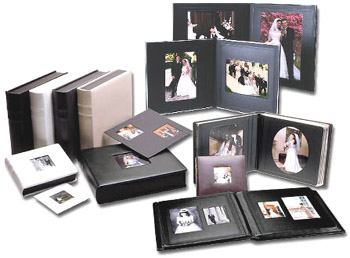

In the old days of film, you had a limit on how many images you had and you gave more thought about the composition and of course you had to had to physically store all of those prints in photo albums and boxes in the top of the closet.

In today's smartphone era, everyone is caring around a camera and snapping images of everything from kids, dinner, funny signs or the usual vacation pictures. Of course, there is no wait, no need to store the prints, not a care in the world…. Till your phone runs out of space!

We have come a long way from having to plug your phone into a usb port and pull your photos off with either iTunes or windows explorer. That takes too long and all it does is move those precious images of the perfect Tiramitsu from your phone to your computers hard drive. A better solution is cloud storage and backup. I have had many people ask what is the best solution for backing up and sorting photos (more on that later). So lets discuss a few:

1. **iCloud** – This is iOS only…. simply put avoid it! Its not free and of all the solutions I have looked at or talked to people about, this one has been plauged by lost photos or it just stops working.
2. **Dropbox** – I use Dropbox regularly and i have my phone automatically back up photos to Dropbox. I can then easily access these from any computer or laptop connected to Dropbox. Pretty easy, but unless you pay for a pro account, you only have so much space available.
3. **Google Photos** – Google photos has gone through many iterations over the years. From the early days of Picasa to today's modern powerhouse. Google photos is the way to go for photo backup. First, like Dropbox it is cross platform so you can use it on your iPhone, iPad, or Android device. Second and most importantly, Google now offers free unlimited storage of photos, as long as you keep the size to _**just**_ 16 megapixels! To put that into perspective you only need about [14 megapixels for an 11″x14″ print!](http://www.adorama.com/alc/0008392/article/100-in-100-Size-Matters) Once your photos are all in the google cloud, just go to the web interface and download all you want. Photo by photo or entire albums.
4. **Amazon PrimePhotos** – I haven't used this at all. If you use Amazon Fire Devices and already pay for the annual prime membership, then it could be a perfectly valid way to store you photos too.

So what's the best… Honestly i recommend picking at least two different ways. Why? Because you want to protect your precious photos from getting lost and you should always have multiple backups in completely different locations. I personally upload to Dropbox and copy them over to my computers hard drive every so often to free up space in my Dropbox account. I also upload all my photos to google photos, which is where i view, sort, and actually "use" my photos.

But Joe, Google steals all your data and gives it to the Government….. Oh boy Don't get me started on this crap. Yes they access your data, do they give it Government? Yes, they do, if ordered by a court! So unless you are doing something that would get a court to subpoena your data you are probably safe. Okay Joe fine…. But they still use your data to sell you stuff…. Yup that they do. But at least if they get to know you the ads that you have to see anyway are more likely to be for something you actually WANT!

I could go on for days, but in the end you are getting unlimited storage and as we will discuss in a moment some super powerful software all for the cost of some better ads, sounds okay to me.

Anyway, Back to our original story. Now we have your precious photos backed up. But how do you sort them. In the old days that was going the craft store and buying a photo album and painstakingly placing your prints in the order you want. Today you need software to help sort all your photos. I have tried many an application, from picasa, irfanview, XnView, and even Adobe Lightroom, but my pick for sorting and organizing your photo is….

**Google Photos!!!!**

For me, all of my photos are already there and the best thing is that google does all of your sorting, tagging people, places, things, and stuff for you!

Like any system, you can make your own albums, but it is so much better if you let google just do it's thing. By default google sorts them by the time-stamp embedded in your photos creating "albums" by date. I say albums because unlike print photos, a photo can exist in more than one album, but is not duplicated. It also uses the GPS data from your photo to tag where the photo was taken, creating albums by place or even by trip if it notices the places are all connected. Note: when you share a photo from google photos, it offers to strip the location data out to protect you (see not so evil!)

Then the magic of machine learning takes over. Googles computers analyze your pictures, use facial recognition to create photos of people. it doesn't know their names (unless you tell google photos who they are) but it is amazing how it can group photos of your kids from birth to teens!

It will also group all your pet photos, food photos, etc. Google's tagging system also tries to identify what it is. so you can search "pasta" and it will find all your pasta foodie pictures! I just searched for Beer and it even found the beer bottle in the back of my soap making picture from 2011!

Do keep in mind all of this processing takes time, so your albums will build up over a day or two after your initial upload. You will also get alerts for new collages, mini videos, suggested rotations (yup it can auto rotate all those sideways images!) and other "auto awesome" that are created by google as it tries to enhance your photos.

So do yourself a favor and try google photos as one of your backup solutions and as your photo organizing tool! I don't think you will be disappointed.
